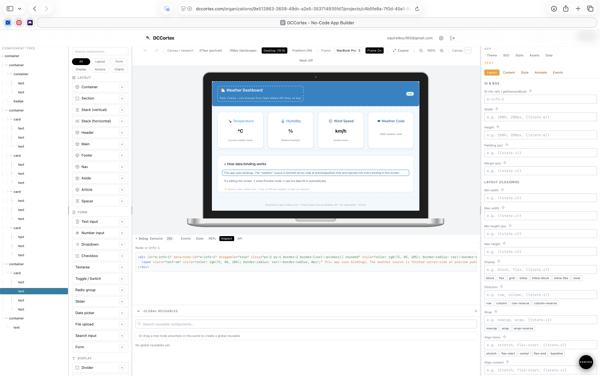

# DCCortex

Build and run full applications with a visual builder, runtime APIs, and deployable self-host infrastructure.

DCCortex is built for:
- Product teams that want fast app delivery.
- Organizations that need self-hosting control.
- Enterprise environments that require compliance-oriented release gates.

## What This Repository Contains

- `dashboard/`: Next.js dashboard and visual builder.
- `platform-api/`: backend service for platform/runtime operations.
- `docker-compose.yml`: production-style stack baseline.
- `docker-compose.dev.yml`: local development stack.
- `docker-compose.scale.yml`: horizontal scale profile.
- `deployment/kubernetes/charts/dccortex/`: Helm chart scaffold for enterprise Kubernetes mode.
- `docs/enterprise/`: enterprise release contract, controls, hardening, and operations documentation.

## Deployment Modes

### 1. Normal Hosting (managed by you)

Use standard Docker deployment for internet-facing environments where you operate the stack.

### 2. Self-Hosting (customer-owned infra)

Use Compose-based deployment for customer-managed Linux VM environments.

### 3. Enterprise Hosting (compliance-focused)

Use the enterprise release pack and Kubernetes/Helm pathway for strict operational and compliance requirements.

Start here:
- `docs/enterprise/README.md`
- `docs/enterprise/RELEASE_ENTERPRISE_SELF_HOST_1_0.md`

## Visual Builder

DCCortex provides a drag-and-drop visual editor for building production applications without code. Connect any database or API, design interfaces in real-time, and deploy instantly.



The builder generates production-grade applications with automatic data binding, real-time validation, and enterprise controls built in.

## Quick Start (Local)

1. Start core infra services:

```bash
docker compose -f docker-compose.dev.yml up -d postgres redis
```

2. Start dashboard:

```bash
cd dashboard
npm ci
npm run dev
```

3. Start platform API:

```bash
cd platform-api
npm ci
npm run dev
```

4. Optional end-to-end smoke test:

```bash
./test-end-to-end.sh
```

## Production Baseline

For a production-style local/VM startup path:

```bash
./start-production.sh
```

This brings up the Compose-managed backend services and checks health.

## Enterprise Release Readiness

This repository includes release gating scaffolding for enterprise delivery:

- CI workflows in `.github/workflows/`
- Gate scripts in `scripts/ci/`
- Compliance and operations docs in `docs/enterprise/`

Minimum release rule:

Do not tag an enterprise release until all required gates in `docs/enterprise/RELEASE_ENTERPRISE_SELF_HOST_1_0.md` are green with evidence attached.

## Current Direction

DCCortex is actively focused on:
- Builder and runtime feature development.
- Self-host and enterprise deployment maturity.
- Compliance-aware release operations.

If you are implementing features, build against the enterprise release contract from day one so product velocity and release readiness move together.
# Test PR
